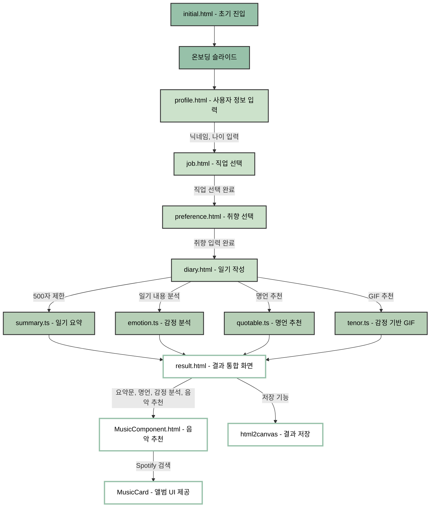

# JS-12-diary-4view: FrontEnd BootCamp 13기 JS 프로젝트 12조

# 그림 일기 큐레이션

GPT와 Spotify, Tenor API를 활용해 일기를 다채로운 콘텐츠로 시각화하는 감정 기반 웹 애플리케이션

## 서비스 소개

이 웹 애플리케이션은 사용자가 작성한 일기를 바탕으로 다양한 AI 분석과 콘텐츠 추천을 통해 감정과 경험을 시각화하는 감정 기반 웹 서비스입니다. 단순히 하루를 기록하는 데 그치지 않고, AI가 사용자의 글을 분석하여 감정 상태를 파악하고, 그 감정에 어울리는 명언, 음악, 이미지 등을 추천하며, 요약과 키워드 추출을 통해 하루를 정리해주는 기능을 제공합니다.

일기를 작성하면 사용자의 감정이 어떻게 분포되어 있는지 시각적으로 확인할 수 있고 각 감정에 맞는 GIF, 음악 콘텐츠, 명언, 차트 등이 제공되어 사용자에게 더 풍부한 정서적 경험을 전달합니다. 또한 일기 내용의 핵심을 요약해 하루의 경험을 되짚는 데 도움을 줍니다.


✏️ 하루 기록과 감정 정리

### 부담 없이 자연스럽게 기록
➡️ 간단한 메모 형식으로 빠르게 정리할 수 있어, 매일 꾸준히 자신의 하루를 담아내는 습관을 형성할 수 있습니다.

### AI 기반 콘텐츠 분석
➡️ 단순한 일기 작성에 그치지 않고, AI가 사용자의 글을 다양하게 해석하여 그에 맞는 명언, 요약, 이미지, 음악 등을 추천합니다. 감정 기반 콘텐츠 구성으로 감정 표현의 다양성과 몰입도를 높입니다.

### 서비스 플로우


## 프로젝트 구조 및 담당자

```
📁 src/
│
├── 📁 pages/
│   ├── 📁 userInfo/                        # 사용자 정보 입력 및 취향 설정
│   │   ├── profile.html                   # 닉네임/나이 입력
│   │   ├── job.html                       # 직업 선택
│   │   ├── preference.html                # 음악/그림 취향 선택
│   │
│   ├── 📁 diary/                           # 일기 작성 및 분석 흐름
│   │   ├── diary.html                     # 일기 작성
│   │   ├── MusicComponent.html            # 음악 추천 화면
│   │   ├── result.html                    # 분석 결과 통합 화면
│   │
│   ├── initial.html                       # 온보딩 페이지
│
├── 📁 components/
│   ├── 📁 MusicCard/                       # 음악 카드 UI 및 Spotify 검색
│   │   ├── index.ts                       # 음악 카드 컴포넌트
│   │   ├── init.ts                        # 초기화 및 검색 흐름
│   │   └── SpotifySearch.ts              # Spotify API 연동
│
├── 📁 utils/
│   ├── openai.ts                          # GPT 기반 이미지/음악 추천
│   ├── spotify.ts                         # Spotify API 처리 유틸
│   ├── utils.ts                           # 공통 유틸 함수
│
├── 📁 services/
│   ├── profile.ts                         # 닉네임/나이 유효성 검사 및 저장
│   ├── diary.ts                           # 일기 저장 및 이동 처리
│   ├── quotable.ts                        # 명언 필터링 및 GPT 추천
│   ├── summary.ts                         # GPT 요약 요청 처리
│   ├── tenor.ts                           # 감정 태그 기반 GIF 추천
│   ├── job.ts                             # 직업 선택 슬라이더 및 저장
│   ├── emotion.ts                         # 감정 분석 및 차트 렌더링
│   ├── chatbot.ts                         # 공감 메시지 생성
│   ├── preference.ts                      # 취향 선택 UI 및 저장
│   ├── result.ts                          # 결과 통합 렌더링
```

---

## 기술 스택

| 분류          | 툴                                                                                                                                                                                                                                                                                                                                                                                                 |
| ------------- | -------------------------------------------------------------------------------------------------------------------------------------------------------------------------------------------------------------------------------------------------------------------------------------------------------------------------------------------------------------------------------------------------- |
| 언어          |     |
| 개발 환경     |                                                                                                                                                                                     |
| 협업          |                          |
| AI 및 API     |                |
| 시각화 도구   |                                                                                                 |
| 기타 유틸리티 | localStorage, URLSearchParams, TypeIt 타이핑 효과                                                                                                                                                                                                                                                                                                                                                  |

---

## 주요 기능 흐름

1. **초기 진입 (`initial.html`)**
   → 앱 소개 및 온보딩 → 사용자 정보 입력

2. **사용자 정보 입력**

   - `profile.html`: 닉네임, 나이 입력 (로컬 저장)
   - `job.html`: 직업 선택 슬라이더 (최대 3페이지, 클릭 시 저장 및 이동)
   - `preference.html`: 음악/그림 취향 선택 (동적 카드 렌더링)

3. **일기 작성 및 분석**

   - `diary.html`: 일기 작성 및 글자 수 제한 (500자)
   - `quotable.ts`: 일기 내용과 태그를 기반으로 명언 추천 (GPT + Quotable JSON)
   - `summary.ts`: 3줄 이내 요약 (GPT)
   - `emotion.ts`: 감정 점수 및 키워드 분석 후 시각화 (도넛 차트 + 해시태그)
   - `tenor.ts`: 감정 태그 기반 GIF 추천

4. **음악 추천**

   - `MusicComponent.html`: GPT가 추천한 곡명을 바탕으로 Spotify 검색
   - `MusicCard`: 앨범 이미지, 미리듣기 UI 제공

5. **결과 통합 화면** (`result.html`)

   - 요약문, 명언, 이미지, 감정 분석 결과, 공감 메시지, 음악 추천 등 병렬로 fetch
   - TypeIt으로 텍스트 효과 / html2canvas로 저장 기능 제공

---

## 핵심 AI 프롬프트 전략

| 기능           | 프롬프트 요약                                                   |
| -------------- | --------------------------------------------------------------- |
| 요약           | "1인칭, 과거형, 감정+행동 중심, 해석 금지, 3줄 이내"            |
| 명언 선택      | "명언 리스트와 일기를 비교해 가장 적절한 명언 선택 + 한글 번역" |
| 감정 분석      | "감정 점수(0\~100), 핵심 키워드 최대 5개로 JSON 응답"           |
| 공감 메시지    | "일기를 바탕으로 공감 가능한 따뜻한 문장 생성"                  |
| 음악/그림 생성 | "취향 키워드와 일기 내용을 포함한 자연스러운 프롬프트 구성"     |

---

## 실행 방법

```bash
# 로컬 실행 (Vite 기준)
npm install
npm run dev
```

---

## 팀원 역할 분담

| 이름   | 주요 담당                                   |
| ------ | ------------------------------------------- |
| 김준성 | 일기 작성, 명언 선택, 요약, 감정 분석, 저장 |
| 문서인 | 직업 슬라이더, 감정 차트 시각화, 공감 응답  |
| 이우민 | 취향 설정, GPT 이미지 생성, 결과 통합 UI    |
| 박시운 | 음악 검색/재생, Spotify API 연동, 온보딩    |

---

## 시연 이미지

| 초기 온보딩                                                                                | 감정 분석 결과                                                                           | 음악 추천                                                                                |
| ------------------------------------------------------------------------------------------ | ---------------------------------------------------------------------------------------- | ---------------------------------------------------------------------------------------- |
|  |  |  |
